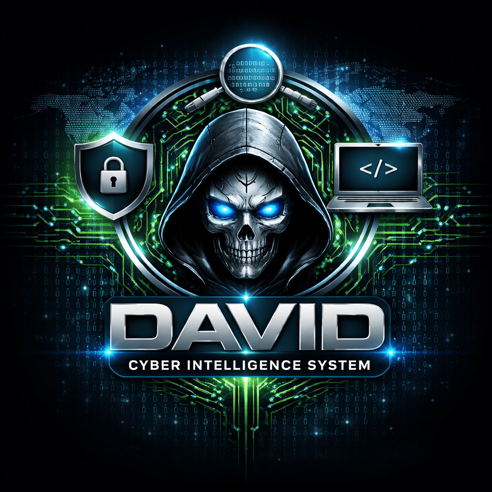

# DAVID CYBER INTELLIGENCE SYSTEM v1.0

<div align="center">



**Developed by Devil Pvt Ltd & Nexuzy Tech Pvt Ltd**


> **A TRUE AI-Powered Cybersecurity Platform — NOT just an AI assistant**

</div>

---

## 🏗️ Core Architecture

```
┌────────────────────────────────────────────────────┐
│          LLM BRAIN  (Mixtral GGUF)                 │
│          via ctransformers                         │
│   Intent + Reasoning + Explanation + Routing       │
└──────────────────────┬─────────────────────────────┘
                       │
              ┌────────▼────────┐
              │   TASK ROUTER   │
              └────────┬────────┘
                       │
 ┌──────────┬──────────┼──────────┬──────────┬──────────┐
 │ Malware  │ Network  │  OSINT   │ Pentest  │ Defense  │
 │ Engine   │ Engine   │  Engine  │ Engine   │ Engine   │
 │ YARA     │ Scapy    │ Shodan   │ Nmap     │ Open-    │
 │ pefile   │ Suricata │ SpiderFt │ SQLMap   │ AppSec   │
 │ XGen-Q   │ LSTM IDS │ CyNER    │ DeepExpl │ WAF      │
 └────┬─────┴─────┬────┴─────┬────┴─────┬────┴─────┬────┘
      └───────────┴──────────┴──────────┴──────────┘
                       │
          Threat Intelligence Layer
           (MISP + OpenCTI + Neo4j)
                       │
             ┌─────────▼──────────┐
             │   Unified Threat   │
             │   Score + Report   │
             └────────────────────┘
                       │
     ┌─────────────────┴──────────────────┐
     │  Bug Bounty   │  SOC / SIEM        │
     │  Platform     │  Wazuh + ELK       │
     └───────────────┴────────────────────┘
                       │
     PostgreSQL + Elasticsearch + Neo4j + SQLite
```

---

## ✅ Full Feature Matrix

### 🔴 1. Offensive Security Engine

| Feature | Tool | Model | Status |
|---------|------|-------|--------|
| Port & Service Scan | Nmap `-sV -sC` | — | ✅ |
| CVE Detection | Nmap + vulners script | — | ✅ |
| SQL Injection Test | SQLMap | — | ✅ |
| Web App Testing | OWASP ZAP API | — | ✅ |
| Brute Force Test | Hydra | — | ✅ |
| Auto Exploitation | DeepExploit + MSF | RL Agent | ✅ |
| Pentest Workflow | PentestGPT logic | LLM | ✅ |
| AI Explains Findings | Mixtral GGUF | LLM | ✅ |
| AI Patch Suggestions | Mixtral GGUF | LLM | ✅ |

### 🦠 2. Malware Engine

| Feature | Tool | Model | Status |
|---------|------|-------|--------|
| Signature Detection | YARA rules | Pattern match | ✅ |
| Binary Parsing | pefile | — | ✅ |
| Disassembly | capstone | — | ✅ |
| Behavior Analysis | XGen-Q reasoning | LLM | ✅ |
| Risk Scoring | Custom scorer | — | ✅ |
| AI Explanation | Mixtral GGUF | LLM | ✅ |

**Flow:**
```
File Input → YARA scan → pefile metadata → XGen-Q behavior → LLM explain + risk score
```

### 🌐 3. Network IDS Engine

| Feature | Tool | Model | Status |
|---------|------|-------|--------|
| Packet Capture | Scapy | — | ✅ |
| IDS/IPS Alerts | Suricata | Rules engine | ✅ |
| Traffic Logs | Zeek | — | ✅ |
| Anomaly Detection | LSTM Autoencoder | Deep Learning | ✅ |
| Phishing Detection | DQN model | RL | ✅ |
| AI Attack Explanation | Mixtral GGUF | LLM | ✅ |

**Flow:**
```
Network Traffic → Scapy capture → Suricata alerts → ML anomaly detect → LLM explain
```

### 🕵️ 4. OSINT Engine

| Feature | Tool | Model | Status |
|---------|------|-------|--------|
| IP/Domain Recon | SpiderFoot | — | ✅ |
| Email Harvesting | theHarvester | — | ✅ |
| Exposed Services | Shodan API | — | ✅ |
| Entity Extraction | CyNER | NER model | ✅ |
| Threat Correlation | Mixtral GGUF | LLM | ✅ |

**Flow:**
```
IP/Email/Domain → OSINT tools → CyNER extracts IPs/CVEs/domains → LLM correlates
```

### 🛡️ 5. Defense Engine (WAF + AppSec)

| Feature | Tool | Status |
|---------|------|--------|
| ML-based WAF | Open-AppSec | ✅ |
| Auto-learning firewall | Open-AppSec | ✅ |
| Attack detection | Pattern + ML | ✅ |
| IP blocking | Defense Engine | ✅ |
| Threat DB storage | PostgreSQL | ✅ |

**Flow:**
```
Incoming Request → Open-AppSec analyze → Attack detected → Block/Allow → Store in DB
```

### 🧠 6. Threat Intelligence Engine

| Feature | Tool | Status |
|---------|------|--------|
| IOC Database | MISP | ✅ |
| Graph Intelligence | OpenCTI | ✅ |
| IP/Hash/Domain Lookup | MISP API | ✅ |
| Relationship Mapping | Neo4j | ✅ |
| Cross-module correlation | All engines | ✅ |

**Flow:**
```
All modules → Store IOC in MISP → Build graph in OpenCTI → Cross-check new threats
```

### 🔍 7. SOC / Defensive AI Layer

| Feature | Tool | Status |
|---------|------|--------|
| SIEM Log Collection | Wazuh | ✅ |
| Log Indexing | Elasticsearch (ELK) | ✅ |
| Anomaly Detection | LSTM + ML | ✅ |
| Behavior Analysis | Pattern engine | ✅ |
| Real-time WebSocket Alerts | FastAPI WS | ✅ |
| Auto IP Blocking | SOC Engine | ✅ |
| Log File Analysis | SOC Engine | ✅ |
| Failed Login Detection | Wazuh rules | ✅ |

### 🐞 8. Bug Bounty Platform

| Feature | Status |
|---------|--------|
| Bug Submission API | ✅ |
| AI Auto-Validation | ✅ |
| CVSS v3.1 Auto-Scoring | ✅ |
| Duplicate Detection (hash) | ✅ |
| Screenshot / PoC Upload | ✅ |
| Auto Severity Classification | ✅ |
| Admin Approve/Reject Panel | ✅ |
| Reward Tracking & Leaderboard | ✅ |

**Bug Bounty Flow:**
```
User submits bug
      ↓
AI validates (real vulnerability?)
      ↓
CVSS v3.1 auto-scored
      ↓
Duplicate check (SHA256 hash)
      ↓
Admin approves
      ↓
Reward issued
```

### ⚙️ 9. Automation Layer

| Feature | Status |
|---------|--------|
| Scheduled Scans (background thread) | ✅ |
| Email Alerts (SMTP) | ✅ |
| Telegram Bot Alerts | ✅ |
| Auto Patch Suggestions | ✅ |
| Auto IP Block on HIGH/CRITICAL | ✅ |

### 🌍 10. Tracking & Intelligence

| Feature | Source | Status |
|---------|--------|--------|
| Flight Tracking | OpenSky Network | ✅ |
| Ship Tracking | AIS / MarineTraffic | ✅ |
| Satellite Tracking | CelesTrak + Skyfield | ✅ |
| IP Geolocation | ip-api.com | ✅ |
| OSINT Recon | Shodan + SpiderFoot | ✅ |

---

## 🧠 Unified Threat Scoring

```
Threat Score = Malware Score + Network Score + OSINT Score + Intel Match

  0–24   → LOW      (green)
 25–49   → MEDIUM   (yellow)
 50–74   → HIGH     (orange)
 75–100  → CRITICAL (red)
```

---

## 🗄️ Data Layer

| Storage | Purpose |
|---------|---------|
| PostgreSQL | Structured threat data, bug reports, user data |
| Elasticsearch | Log indexing, SIEM search, ELK stack |
| Neo4j | Threat relationship graphs, attack chains |
| SQLite | Local bug bounty DB, cache |
| JSON | Fast module output cache |

---

## 🔄 Full Execution Flow

```
User Query / File / IP / Log Input
        ↓
LLM Brain (understand intent)
        ↓
Task Router selects module
        ↓
Module runs: tool + AI model
        ↓
Threat Intel cross-check (MISP/OpenCTI)
        ↓
LLM merges all results
        ↓
Final Output:
  - Threat Score (0-100)
  - Attack Type & Explanation
  - Fix / Patch Suggestion
  - IOC stored to DB
```

---

## 🚀 Quick Start

See **[SETUP.md](SETUP.md)** for full installation guide.

```bash
git clone https://github.com/david0154/david-cyber-intelligence-system
cd david-cyber-intelligence-system
pip install -r requirements.txt
cp .env.example .env

# GUI Desktop App
python gui_app.py

# CLI
python main.py

# API
uvicorn core.api:app --reload --port 8000

# Bug Bounty API
uvicorn bounty.api:app --reload --port 8001
```

---

## 🤖 AI Natural Language Commands

```bash
"Scan my server 192.168.1.1"        → Nmap + CVE scan + AI report
"Test web app https://mysite.com"   → ZAP scan + SQLMap + AI fixes
"Analyze this file malware.exe"     → YARA + pefile + risk score
"Show live attacks"                 → Wazuh SIEM alerts
"Check IP 1.2.3.4"                  → OSINT + MISP + Shodan
"Fix vulnerability CVE-2024-1234"  → AI patch suggestion
"What ports are open on 10.0.0.1?" → Nmap scan
```

---

## ⚠️ Legal Disclaimer

> This system is for **authorized security testing only**.  
> Always obtain **written permission** before scanning any system.  
> Unauthorized use is illegal and the developer is not responsible for misuse.

---

## 👨‍💻 Developer

**David**  
Full-Stack Security Engineer  
Nexuzy Tech Pvt Ltd | Devil Pvt Ltd  
Kolkata, West Bengal, India  
https://hypechats.com
